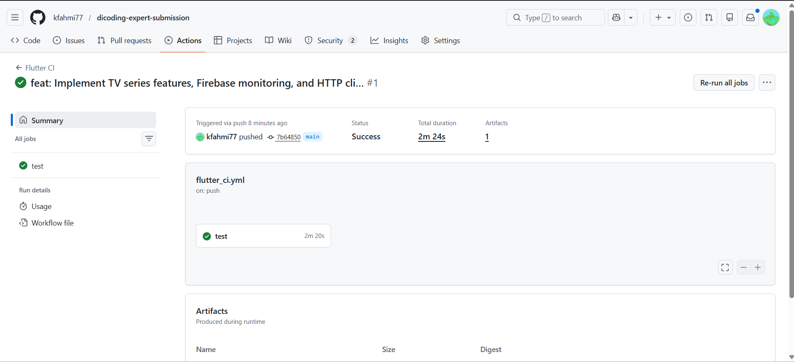
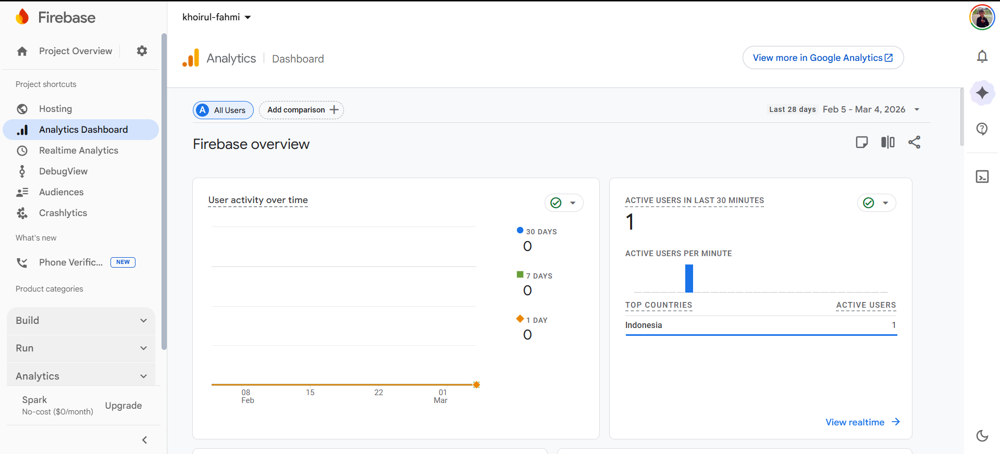
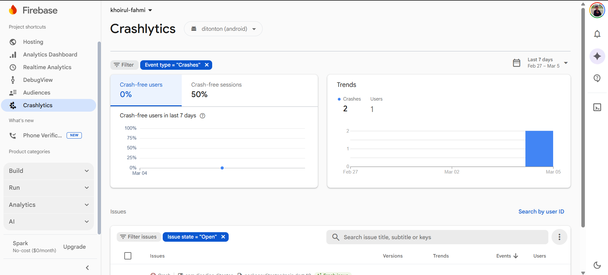

# Ditonton Flutter Expert Submission

[](https://github.com/kfahmi77/dicoding-expert-submission/actions/workflows/flutter_ci.yml)

Aplikasi katalog movie dan TV series berbasis Flutter untuk submission Dicoding Flutter Expert.

## Implementasi Kriteria Wajib

- Continuous Integration dengan GitHub Actions (`push` dan `pull_request`).
- Migrasi state management dari Provider ke BLoC/Cubit (`flutter_bloc`).
- SSL Pinning pada koneksi TMDB dengan sertifikat yang dipasang di HTTP client.
- Integrasi Firebase Analytics dan Crashlytics pada bootstrap aplikasi.
- Modularisasi multi-package untuk fitur `movie` dan `tv_series`.

## Struktur Modularisasi

Repositori ini menggunakan Dart workspace dengan tiga package utama:

- `packages/core`: shared concern (theme/constants, failure/exception, state enum, route observer, SSL pinning, database helper).
- `packages/movie`: full stack fitur movie (data, domain, presentation, bloc, provider legacy, routes, DI registration).
- `packages/tv_series`: full stack fitur tv series (data, domain, presentation, bloc, provider legacy, routes, DI registration).

Root app bertindak sebagai app shell yang mengorkestrasi route dan dependency injection antar modul.

## Menjalankan Proyek

```bash
flutter pub get
flutter run
```

## Menjalankan Analyze & Test Semua Modul

```bash
flutter analyze
flutter test --coverage

cd packages/core && flutter pub get && flutter analyze && flutter test --coverage
cd ../movie && flutter pub get && flutter analyze && flutter test --coverage
cd ../tv_series && flutter pub get && flutter analyze && flutter test --coverage
```

## Lampiran Screenshot

### Build CI (GitHub Actions)



### Firebase Analytics



### Firebase Crashlytics



## Catatan Firebase

Tambahkan konfigurasi Firebase proyek Anda sendiri untuk Android/iOS agar data Analytics dan Crashlytics tercatat ke Firebase Console.
